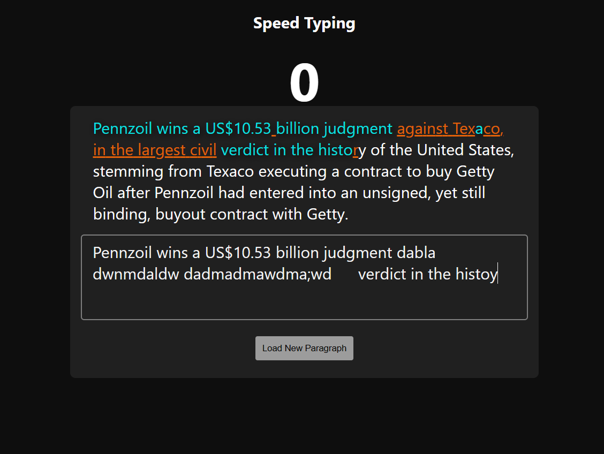

Website I am using: https://api-ninjas.com/

API : https://api.api-ninjas.com/v1/loremipsum

## Speed Typing 



#### What you can do
You can load a new paragraph and start typing, it will show a timer and correct and incorrect words upon typing.

### For `config`

- This is to avoid the apiKey to upload into github.

Create a `config.js` file in the root directory and paste this :

// config.js

```js
const config = {
	apiKey: 'your-api-key',
	historicalEventApiUrl: 'https://api.api-ninjas.com/v1/historicalevents?text=',
	randomWordApiUrl: 'https://api.api-ninjas.com/v1/randomword',
};
```
Then go-to `index.html` and add this line

`NOTE`: Add the config.js before the script.js

```html
	<head>
        // -- rest code --
		<script src="config.js" defer></script> // added here
		<title>Speed Typing</title>
	</head>
```

Add this `config.js` to `.gitignore`


// .gitignore

```
config.js
```